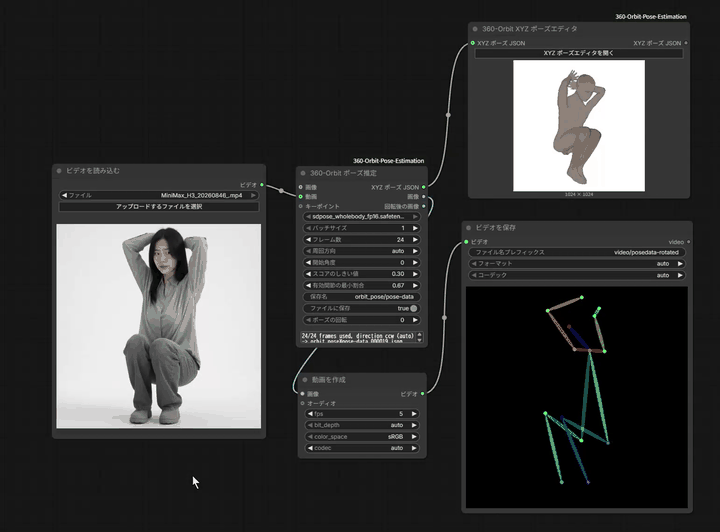
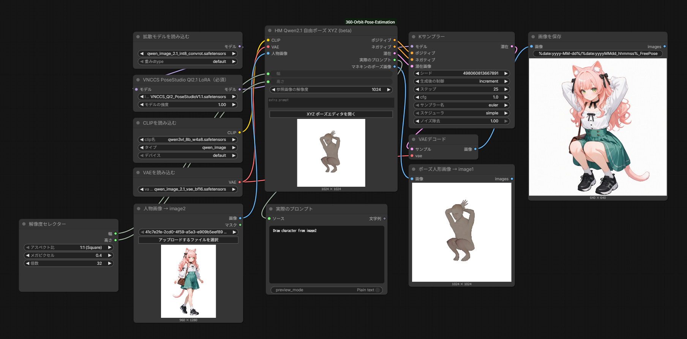

# ComfyUI-360-Orbit-Pose-Estimation

[English](README.md) | [日本語](readme-jp.md) | [中文](readme-cn.md)

[](assets/pose-estimation-360-orbit-sample.mp4)

*点击动画即可打开完整视频（mp4，带声音）。*

## 概述

本项目可以从一张人物图像高精度地估计姿势，生成 XYZ 坐标数据和任意角度的骨架图。XYZ 坐标数据可用于 Qwen Image 2.1 配合 VNCCS PoseStudio LoRA 的姿势指定。骨架图可作为各类生成式 AI 的 ControlNet 姿势图使用。

姿势估计按以下步骤进行。

- 利用人物图像，使用 MiniMax H3 360 Orbit LoRA 生成 360 度环绕视频
- 从环绕视频中取出多个角度的图像，对每张图像进行姿势估计（估计身体部位的 xy 坐标）
- 根据多个角度估计出的 xy 坐标数据，用最小二乘法等方法估计 z 坐标

360° 环绕视频（相机绕静止人物转一圈的视频）预计使用 MiniMax H3 的「360 ORBIT」工作流生成，但并不一定要使用它。只要能生成匀速旋转的 360 度环绕视频，用其他生成式 AI 生成的视频或实拍视频，也可以进行姿势估计。

## ComfyUI 自定义节点

以下是本仓库包含的 ComfyUI 自定义节点。

- **360-Orbit 姿态估计**（360-Orbit Pose Estimation）：视频（或关键点）→ XYZ 姿势 JSON，以及 OpenPose 风格的骨架图。
- **360-Orbit XYZ 姿势编辑器**（360-Orbit XYZ Pose Editor）：用于载入、修正、旋转和保存 XYZ 姿势的人偶编辑器。
- **HM Qwen2.1 自由姿势 XYZ (beta)**（HM Qwen2.1 Free Pose XYZ (beta)）：Fisher 的 Qwen Image 2.1 自由姿势节点，编辑器增加了载入 XYZ 姿势文件的功能。

界面支持英语、日语和中文（跟随 ComfyUI 的语言设置）。

## 安装与要求

1. 将此文件夹放入 `ComfyUI/custom_nodes/` 并重启 ComfyUI。更新后请刷新浏览器页面（Ctrl+F5），因为编辑器是 Web 扩展。
2. 不附带模型。请自行下载，按用途确认其许可证，并放到以下位置：
   - SDPose（`sdpose_wholebody_fp16.safetensors`）：`models/checkpoints/`
3. 要求：带有 `SDPoseKeypointExtractor`（用于从视频估计姿势）和 `TextEncodeQwenImage21`（用于 Qwen 节点）的 ComfyUI。
4. 附带人偶数据（`web/vnccs/`，约 90 MB），请参阅「来源与许可证」。

模型可从下方链接获取。关于模型的使用条件，请确认各模型的许可证。

- [sdpose_wholebody_fp16.safetensors](https://huggingface.co/Comfy-Org/SDPose/blob/main/checkpoints/sdpose_wholebody_fp16.safetensors)

## 关于输入视频

输入视频必须满足以下全部条件。只要有一项不满足，姿势估计的精度就会下降。

- 是一名人物水平旋转、从 360 度方向连续拍摄的视频
- 时长为 5 秒
- 宽高比为 1:1
- 各帧之间人物的旋转角度恒定
- 第一帧和最后一帧中人物的姿势一致

以下是提高精度的方法。

- 背景使用单一颜色：最好与人物的服装、头发和肤色不同的颜色。
- 让头朝向画面上方：对于躺着的姿势，请先旋转成头在上再进行姿势估计，之后在姿势编辑器中把姿势旋转回躺着的姿势。
- 整个视频中人物的全身都要入镜：如果有些帧中手或脚等离开画面，估计精度会下降。人物前面有桌子等遮挡物，或者人物穿戴、背着或拿着道具（工作工具、球棒等运动器材、乐器、包等），精度也会下降。
- 从任何角度都能看清姿势的服装：斗篷、兜帽、大摆裙、铠甲、头盔等会大幅遮挡手、脚、头的服装，会降低姿势估计的精度。

非实拍的人物图像（例如动漫角色、卡通化的角色）有时无法顺利估计姿势。姿势估计的精度取决于 SDPose 的性能。

使用 MiniMax H3 360 Orbit LoRA 生成视频时，请让输入图像满足以下条件。

- 只有一名人物
- 宽高比为 1:1
- 背景为单一颜色
- 头朝向画面上方

## 工作流

1. [使用 MiniMax H3 360 Orbit LoRA 的 360 度视频生成工作流](workflow/MiniMax-H3-360-ORBIT.json)
2. [从 360 度视频进行高精度姿势估计的工作流](workflow/PoseEstimation-360-orbit.json)
3. [使用 Qwen Image 2.1 VNCCS PoseStudio LoRA 的姿势指定图像生成工作流](workflow/QwenImage2.1FreePose.json)

关于 MiniMax-H3-360-ORBIT 工作流，请参阅 [MiniMax-H3-360-Orbit-LoRA](https://huggingface.co/pablodawson/MiniMax-H3-360-Orbit-LoRA)。

## 非常粗略的步骤

- 用工作流 1 从一张图像生成 360 度旋转视频
- 把 1 中生成的视频载入工作流 2 并运行，然后打开 XYZ 姿势编辑器，下载 xyz 姿势数据（json 文件）
- 在工作流 3 的「HM Qwen 2.1 自由姿势 XYZ」节点中，载入下载的 xyz 姿势数据（json 文件）（用「打开文件…」选择），修改后点击「应用到节点」按钮应用。
- 向工作流 3 输入想要摆出该姿势的人物图像并运行。

[](assets/qwen-image-2.1-pose-image-sample.png)

## 节点（分类 `360-Orbit`）

### 360-Orbit 姿态估计

前提：人物静止，相机绕人物以恒定速度沿垂直轴旋转，所选帧的第一帧是一圈的起点（最后一帧使一圈闭合）。在所有选取的帧上，把每个关节的位置拟合为相机角度的正弦波，从而得到 X、Y、Z（弱透视模型）。

**输入**：使用其中一个（优先级为 `keypoints` → `images` → `video`；都没有连接时报错）。

| 输入 | 说明 |
|---|---|
| `images` | 环绕视频的 IMAGE 批次 |
| `video` | VIDEO（如 Create Video / Load Video） |
| `keypoints` | 任意估计器输出的全部帧的 POSE_KEYPOINT（像素坐标或 0–1 归一化坐标均可） |

**参数**

| 参数 | 默认值 | 说明 |
|---|---|---|
| `ckpt_name` | `sdpose_wholebody_fp16.safetensors` | SDPose 模型（checkpoints 文件夹）。 |
| `batch_size` | 1 | SDPose 每次处理的帧数。为避免显存不足，请保持较小。 |
| `frame_count` | 24 | 用于估计的帧数，在一圈内等间隔选取。 |
| `direction` | `auto` | 从上方看相机的旋转方向：`ccw`、`cw` 或 `auto`。`auto` 会选择使鼻子位于脖子前方、膝盖位于髋–踝连线前方的方向。方向选错会使前后颠倒。 |
| `start_angle` | 0 | 第一帧的相机方位角（度）。为 0 时，第一帧看到的是人物正面。 |
| `score_threshold` | 0.3 | 得分低于此值的关节视为未检测到。 |
| `min_valid_ratio` | 2/3 | 检测到的关节比例不超过此值的帧不参与估计。 |
| `save_name` | `orbit_pose/pose-data` | 相对于输出文件夹的保存位置（可含子文件夹，不能超出输出文件夹）。会加上 6 位编号：`pose-data_000001.json`，之后是 `_000002`……（按名称分别计数，不会覆盖）。 |
| `save_file` | 开 | 将 XYZ JSON 保存为文件。 |
| `pose_rotation` | 0 | 将估计出的姿势旋转 0 / 90 / 180 / 270°（按第一帧的视角逆时针，以骨盆为中心）。仅在人物在视频中确实是横躺的时候使用。若只是想在编辑器里得到横躺的姿势，请用编辑器的「画面内旋转」。 |

**输出**

| 输出 | 说明 |
|---|---|
| `pose_xyz_json` | XYZ 姿势 JSON（格式见下文）。 |
| `images` | 用 OpenPose 风格绘制的修正后姿势的骨架图，每个参与估计的帧一张，尺寸与输入相同，黑色背景。接入视频合成节点即可得到骨架视频。不含旋转。 |
| `rotated_images` | 反映 `pose_rotation` 后的同样图像（为 0 时与 `images` 相同）。 |

**注意事项**

- 检测到的关节过少时不会报错：节点会输出默认站姿（`meta.estimated` 为 `false`，原因写在 `meta.error`）和全黑图像，并在节点上显示「ESTIMATION FAILED」。降低 `score_threshold` 或 `min_valid_ratio` 往往可以估计成功。未连接输入、缺少模型等设置错误，仍会报错。
- 旋转后躯干不是直立的（脖子不在骨盆上方）时，节点会显示警告，`meta.upright` 为 `false`。编辑器的导入以站立的人物为前提，这样的姿势可能显示为前后颠倒。
- 选定的方向会显示在节点上，并记录在 `meta.direction_used`。

### 360-Orbit XYZ 姿势编辑器

用**打开 XYZ 姿势编辑器**按钮打开人偶编辑器。点击**应用到节点**，编辑后的姿势就会存入节点。

- **输出**：只有 `xyz_json`。在编辑器中应用过则为编辑后的姿势，否则原样输出连接的 `xyz_json` 输入（两者都没有时报错）。
- **输入**：`xyz_json`（可选）。连接的估计节点运行一次后，即可在编辑器中载入。

### HM Qwen2.1 自由姿势 XYZ (beta) – `HMQwenFreePoseXYZ`

在 Fisher 的 `FisherQwenFreePose`（Qwen Image 2.1，单人）基础上，增加了在编辑器中载入 XYZ 姿势的功能。输入、输出和编码都相同：`clip`、`vae`、`reference_image`、`width`、`height`、`reference_resolution`、`extra_prompt`、`pose_json` → `positive`、`negative`、`latent`、`actual_prompt`、`mannequin_pose_image`。人偶图为 image1，人物照片为 image2，提示词为 `Draw character from image2` 加上 `extra_prompt`（VNCCS_QI2_PoseStudio LoRA 的约定）。

- 没有 XYZ 输入端口，请在编辑器中载入 XYZ 文件。人偶图在载入后点击**应用到节点**时生成（不应用就运行会报错，与 Fisher 的节点相同）。
- 除了 XYZ 姿势编辑器的功能外，该节点的编辑器还有补充提示词输入框和人物图预览。
- 未包含：Fisher 编辑器中的 OpenPose 图像图库（内置的 `pose-images/` 骨架图和用户图库）以及由这些图像生成 3D 的处理。骨架图不随附发布；如有需要，请由使用者自行负责地使用 Fisher 的节点（ComfyUI-Fisher-Pose）。
- 不依赖 Fisher 的代码（直接调用 ComfyUI 自带的 `TextEncodeQwenImage21`）。「我的姿势」保存在与 Fisher 相同的文件夹，因此在任一编辑器中保存的姿势，另一个也能读取。

## 编辑器

XYZ 姿势编辑器和 Qwen 节点共用。

- **载入 XYZ**：`output/orbit_pose/` 中的文件列表（可在子文件夹间移动，不能进入 `orbit_pose` 的上级）、「打开文件…」，以及（仅 XYZ 姿势编辑器）所连接节点的输出。
- **前后翻转**：全身、上半身，以及左右的手臂和腿（整条 / 末端部分）。每次翻转都会从 XYZ 数据重新导入姿势，因此手动调整的关节会被替换（有手动调整时会先询问确认）。
- **画面内旋转**：0° / 90° / 180° / 270° 按钮和滑块（逆时针）。姿势先以直立状态导入，然后旋转整个人偶。手脚着地之类的横躺姿势就是这样得到的。旋转会反映在传给节点的图像和「我的姿势」中；保存或下载的 XYZ 文件仍保持直立状态。前后翻转不会改变旋转，载入其他文件后旋转会恢复为 0°。
- **保存**：「保存 XYZ JSON」（保存到 `output/orbit_pose/` 下当前打开的文件夹）、「下载…」，以及「我的姿势」（保存到 `user/default/fisher_pose/poses/`）。
- **警告**：载入或前后翻转会丢失尚未应用到节点、也未保存的编辑时，会先询问确认；载入的姿势是估计失败时的默认站姿，或躯干不是直立的，会给出提示。
- 体型、比例、手和关节旋转的编辑方式与 Fisher 的自由姿势编辑器相同。

## XYZ 姿势 JSON（`orbit-pose-xyz`）

```json
{ "kind": "orbit-pose-xyz", "version": 1, "units": "m", "up": "y",
  "joints": { "pelvis": [0, 0.95, 0], "neck": [x, y, z], "head": [x, y, z],
              "left_shoulder": [..], "left_elbow": [..], "left_wrist": [..],
              "right_shoulder": [..], "right_elbow": [..], "right_wrist": [..],
              "left_hip": [..], "left_knee": [..], "left_ankle": [..],
              "right_hip": [..], "right_knee": [..], "right_ankle": [..] },
  "confidence": { }, "meta": { } }
```

15 个关节，单位为米。Y 轴向上，+Z 是人物面朝的方向，+X 是人物的左侧。骨盆位于 (0, 0.95, 0)，脖子到骨盆的长度为 0.6。`head` 在估计出的文件中是鼻子，在编辑器保存的文件中是头部骨骼。`meta` 记录设置与结果（`direction_used`、`pose_rotation`、`estimated`、`upright` 等）。

## 显示语言

- 节点名称、输入/输出名称、提示和说明：`locales/{en,ja,zh}/nodeDefs.json`（跟随 ComfyUI 的语言设置；保存在工作流中的内部名称不会改变）。
- 编辑器：`web/editor/i18n/{en,ja,zh}.mjs`（其他语言显示为英语）。
- Python 的错误信息和控制台输出只有英语。
- 新增输入、输出或文字时，请同时加入三种语言。

## 安全注意事项

本节点的编辑器会向 ComfyUI 服务器添加以下路由（`/orbit360/*`）。

- `output/orbit_pose/` 下 XYZ 文件的列出、读取、保存
- 「我的姿势」（`user/default/fisher_pose/poses/`）的列出、读取、保存、删除

与 ComfyUI 自带的 `/view`、`/upload` 一样，这些路由没有认证。如果用 `--listen` 等方式把 ComfyUI 公开到网络（互联网或共享的局域网），同一网络中的其他设备就能读写这些文件夹中的文件。公开时请通过防火墙或反向代理的认证等方式限制访问。

- 可读写的只有上述文件夹中的 JSON 文件（拒绝 `..` 和绝对路径，无法走出文件夹）。
- 节点 A 的 `save_name` 只能写入输出文件夹之内，且不会覆盖已有文件。
- 本仓库的代码不会访问网络，也不会访问 ComfyUI 文件夹之外的文件（模型的加载按 ComfyUI 本身的设置进行）。

## 来源与许可证

本项目的代码（© 2026 AI Bard Guild，联系方式：@IsekaiBardGuild，GitHub：[hiderminer](https://github.com/hiderminer)）参照 ComfyUI-Fisher-Pose-i18n（源自 ComfyUI-Fisher-Pose，MIT，© 2026 Work-Fisher）的许可证，以 [MIT 许可证](LICENSE)发布；这里的编辑器以 Fisher 的自由姿势编辑器为基础。第三方组件遵循各自的许可证（见 [THIRD_PARTY_NOTICES.md](THIRD_PARTY_NOTICES.md)）。

- `web/vnccs/`：VNCCS Pose Studio 核心（MiuProject，MIT）、MakeHuman 人体数据包（CC0）和 three.js（MIT），按 ComfyUI-Fisher-Pose 附带的原样复制。请参阅各文件夹中的许可证文件。
- `web/editor/xyzpose.*`、`style.css`、`i18n*`：以 ComfyUI-Fisher-Pose（Work-Fisher，MIT）的自由姿势编辑器为基础，改为可载入、翻转、旋转和保存 XYZ 姿势。
- `assets/`：演示视频、由它制作的预览 GIF 和示例图像均由 AI 生成，不主张著作权（CC0 1.0 Universal；仅涉及维护者自己的权利）。
